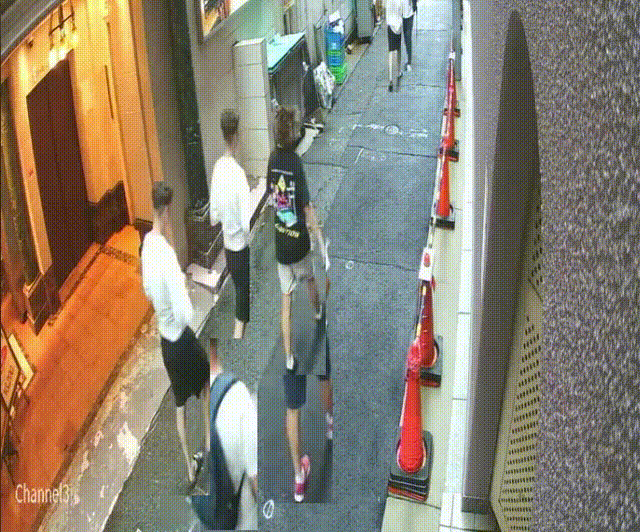
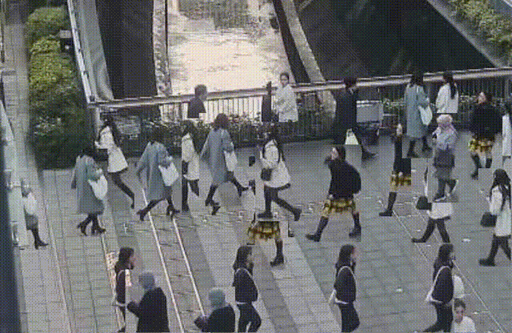

# 時間圧縮可視化: 監視システムの監視を楽にしよう

## はじめに
通常、防犯カメラや監視システムでは、時間とともに流れる映像をリアルタイムでモニタリングします。しかし、対象が映像内に断続的にしか現れない場合、全体像を理解するのは容易ではありません。

たとえば、警察が道路を写した防犯カメラの映像を24時間分確認する場合、かかる時間は24時間。もしその道路がまばらな人通りだった場合、何度も早送りをしながら確認する必要があります。

そのような場合、指定した時間内の人物を一度に確認できる機能があれば、作業を大幅に効率化できます。

そこで登場するのが時間圧縮可視化技術です。

といってもこのような技術が実際に広く認知されているわけではありません[^1]。
[^1]: わたしが知らないだけで大規模システムに似た機能があるかも知れません。ご存知の方がいらっしゃたたら教えてください。

この手法では、映像内で異なるタイミングで検出されたオブジェクト（例：人々の動き）を同じタイムラインに圧縮して同時に表示します。これにより「どこに」「どのように」対象が移動していたのかを直感的に把握することができます。

本記事では、Pythonを使った「時間圧縮可視化」の実装例を紹介します。


- 入力映像（51秒間）: ほとんどの時間何も映らない
  
- 出力映像（5秒間）
  


映像元: [【ビルの防犯カメラ】ビル入退室監視SJC-HRA1500T｜セキュアジャパン](https://www.youtube.com/shorts/-qjtqz6SJCE)

## 環境
```bash
# ホスト環境
$ inxi -SG --filter
System:
  Kernel: 6.8.0-49-generic x86_64 bits: 64 Desktop: Unity
    Distro: Ubuntu 22.04.5 LTS (Jammy Jellyfish)
Graphics:
  Device-1: NVIDIA TU116 [GeForce GTX 1660 Ti] driver: nvidia v: 555.42.06
  Display: x11 server: X.Org v: 1.21.1.4 driver: X: loaded: nvidia
    unloaded: fbdev,modesetting,nouveau,vesa gpu: nvidia
    resolution: 2560x1440~60Hz
  OpenGL: renderer: NVIDIA GeForce GTX 1660 Ti/PCIe/SSE2
    v: 4.6.0 NVIDIA 555.42.06
# 環境構築
$ pip install -U pip wheel setuptools
$ pip install torch torchvision
$ pip install git+https://github.com/levan92/deep_sort_realtime.
$ pip install -r ./damo_yolo/requirements.txt
```

ここでは`DeepSORT`と`DAMO-YOLO`を使用します。
上記のようにインストールしてください。（ここではvenvで仮想環境を作成しました）

`DeepSORT`と`DAMO-YOLO`の実装や解説については参考文献リストをご参照ください。

## 大まかな処理の流れ
実装したコードは、**入力された映像を時間圧縮する**ように実装しています。以下に、その処理を順を追って説明します。

まず入力動画をフレーム単位で読み込み、人物の検出と追跡を行えるように、動画を一時的にリサイズしたり、検出結果を元の解像度に合わせて調整したりします。また、トラッカー（DeepSort）を使用して、検出された人物に一意のIDを割り当て、各人物を継続的に追跡します。

次に時間圧縮の処理を行います。ここでは映像内で異なるタイミングに登場した人物を、同じタイムライン上で一度に表示できるようにします。

各人物の最初に登場したフレームを基準に、すべての人物を0秒から同時に登場させるようにタイムラインを調整します。また、フレームを拡張するオプションをつけました。これによって各人物の表示時間を長くして、見やすい映像を生成します。

最後に新しいフレームを作成します。背景画像に追跡した人物をそれぞれの位置に合成し、新しい映像として構築します。最終的に出力動画として保存されます。

```python: spatio-temporal_video_synthesis.py
"""spatio-temporal_video_synthesis.py.

Summary:
    このスクリプトは、入力動画内の検出された人物を基に時間を圧縮し、
    複数の時間帯に存在した人物を同時に可視化する動画を生成するためのコードです。
    DAMO-YOLOを使って人物を検出し、DeepSORTアルゴリズムで追跡を行います。

    主な特徴:
    - 時間圧縮: 異なる時間に検出された人物を1つのフレームに統合。
    - DAMO-YOLO: リアルタイム物体検出モデル。
    - DeepSORT: 人物の動き追尾する。
    - 動画の時間を指定した長さに調整可能。
    - 背景画像を設定し、検出された人物を重ね合わせた新しい動画を生成。

Example:
    1. 動画や背景画像のパスを指定します（`video_path`と`background_image_path`）。
    2. スクリプトを実行すると、`output_video_path`で指定された場所に結果の動画が保存されます。
    3. 入力フレーム数に応じて出力動画の時間を調整するには、`target_duration_seconds`を設定してください。

Parameters:
    - `video_path` (str): 入力動画のパス。
    - `output_video_path` (str): 出力動画のパス。
    - `background_image_path` (str): 背景画像のパス。
    - `frame_extension_factor` (int): フレーム拡張倍率（1フレームを何倍に引き伸ばすか）。
    - `target_duration_seconds` (int): 出力動画の目標時間（秒単位）。
    - DAMO-YOLO関連:
        - `config_path` (str): DAMO-YOLOの設定ファイルパス。
        - `ckpt_path` (str): DAMO-YOLOの学習済みモデルのパス。
    - DeepSORT関連:
        - `max_age` (int): オブジェクトが検出されなくなってからも追跡を続ける最大フレーム数。
        - `n_init` (int): 追跡を確定するために必要な連続検出回数。

License:
    This script is licensed under the terms provided by the author, including modifications for your specific use case.
"""

from collections import defaultdict

import cv2
from deep_sort_realtime.deepsort_tracker import DeepSort
from tqdm import tqdm  # type: ignore

from damo_yolo.base import COCO_CLASSES, Infer
from damo_yolo.damo_internal.config.base import parse_config

# =========================================================
# 設定値
# =========================================================
frame_extension_factor = 1  # 1フレームをn倍に拡張
target_duration_seconds = 10  # 出力動画の長さをx秒に。

# =========================================================
# 入力動画・背景画像パス、モデルコンフィグ等
# =========================================================
video_path = "assets/ライブカメラ.mp4"   # 入力動画ファイル
output_video_path = "output_video.mp4"      # 出力動画ファイル
background_image_path = "assets/background2.png"  # 背景画像

config_path = "damo_yolo/configs/damoyolo_tinynasL20_T.py"  # 設定ファイルパス
ckpt_path = "damo_yolo/pretrained_models/damoyolo_tinynasL20_T_420.pth"  # チェックポイントファイルパス

# =========================================================
# モデル初期化
# =========================================================
config = parse_config(config_path)  # 設定のパース
infer = Infer(config=config, ckpt_path=ckpt_path)  # 推論インスタンス作成
tracker = DeepSort(
    max_age=60,  # 検出されなくなった後も追跡を続けるフレーム数
    n_init=3     # トラックが「確定」するまでに必要な連続検出回数
)

# =========================================================
# 動画キャプチャの初期化
# =========================================================
cap = cv2.VideoCapture(video_path)  # 入力動画読み込み
frame_rate = cap.get(cv2.CAP_PROP_FPS)  # フレームレート取得
width = int(cap.get(cv2.CAP_PROP_FRAME_WIDTH))  # 幅取得
height = int(cap.get(cv2.CAP_PROP_FRAME_HEIGHT))  # 高さ取得

fourcc = cv2.VideoWriter_fourcc(*'mp4v')  # 出力コーデック
out = cv2.VideoWriter(output_video_path, fourcc, frame_rate, (width, height))  # 出力動画作成

background = cv2.imread(background_image_path)  # 背景画像読み込み
if background is None:
    raise FileNotFoundError("背景画像が読み込めません")

# =========================================================
# データ格納用
# =========================================================
trajectories = defaultdict(list)  # {track_id: [(f_idx, x, y, w, h), ...]}
person_images = {}  # {(track_id, f_idx): image}

total_frames = int(cap.get(cv2.CAP_PROP_FRAME_COUNT))  # 総フレーム数取得

# =========================================================
# フレーム処理ループ
# =========================================================
frame_idx = 0
with tqdm(total=total_frames, desc="Processing video frames") as pbar:
    while cap.isOpened():
        ret, frame = cap.read()
        if not ret or frame is None:
            break

        # 640x640にリサイズ
        resized_frame = cv2.resize(frame, (640, 640))

        # DAMO-YOLOで人物検出
        bboxes, scores, cls_inds = infer.forward(resized_frame)

        # リサイズ前のスケールに戻す
        scale_x = frame.shape[1] / 640
        scale_y = frame.shape[0] / 640
        bboxes = [
            [int(x1 * scale_x), int(y1 * scale_y), int(x2 * scale_x), int(y2 * scale_y)]
            for x1, y1, x2, y2 in bboxes
        ]

        # 人物のみ抽出
        detections = []
        for bbox, score, cls_ind in zip(bboxes, scores, cls_inds):
            if score >= 0.5 and COCO_CLASSES[int(cls_ind)] == "person":
                x1, y1, x2, y2 = bbox
                # 座標クリッピング
                x1 = max(0, min(x1, frame.shape[1] - 1))
                y1 = max(0, min(y1, frame.shape[0] - 1))
                x2 = max(0, min(x2, frame.shape[1] - 1))
                y2 = max(0, min(y2, frame.shape[0] - 1))

                w = x2 - x1
                h = y2 - y1
                detections.append(([x1, y1, w, h], score, "person"))

        # トラッカー更新
        tracks = tracker.update_tracks(detections, frame=frame)

        # 検出人物を保存
        for track in tracks:
            if not track.is_confirmed():
                continue
            track_id = track.track_id
            x, y, w, h = track.to_tlwh()
            x, y, w, h = int(x), int(y), int(w), int(h)

            if w > 0 and h > 0:
                person_crop = frame[y:y + h, x:x + w].copy()
                person_images[(track_id, frame_idx)] = person_crop
                trajectories[track_id].append((frame_idx, x, y, w, h))

        frame_idx += 1
        pbar.update(1)

cap.release()

# =========================================================
# 時間リスケーリング修正（全員0秒から登場）
# =========================================================
target_duration = int(target_duration_seconds * frame_rate)

rescaled_trajectories = defaultdict(list)  # {new_f_idx: [(track_id, orig_f_idx, x, y, w, h), ...]} # orig_f_idxも格納

for track_id, frames in trajectories.items():
    frames_sorted = sorted(frames, key=lambda x: x[0])

    if len(frames_sorted) < 1:
        continue

    earliest_orig_fidx = frames_sorted[0][0]

    for i in range(len(frames_sorted) - 1):
        orig_f_idx, x, y, w, h = frames_sorted[i]
        orig_f_idx_next, x_next, y_next, w_next, h_next = frames_sorted[i + 1]

        shifted_f_idx = orig_f_idx - earliest_orig_fidx
        shifted_f_idx_next = orig_f_idx_next - earliest_orig_fidx

        start_new_f_idx = shifted_f_idx * frame_extension_factor
        end_new_f_idx = shifted_f_idx_next * frame_extension_factor
        total_steps = end_new_f_idx - start_new_f_idx
        if total_steps <= 0:
            continue

        for step in range(total_steps):
            alpha = step / float(total_steps)
            inter_x = int(x + (x_next - x) * alpha)
            inter_y = int(y + (y_next - y) * alpha)
            inter_w = int(w + (w_next - w) * alpha)
            inter_h = int(h + (h_next - h) * alpha)

            current_f_idx = start_new_f_idx + step
            if 0 <= current_f_idx < target_duration:
                # 補間した時点のorig_f_idxも近似
                # ここでは単純にfloorで計算（より正確には丸めてよい）
                inter_orig_fidx = int(orig_f_idx + (orig_f_idx_next - orig_f_idx) * alpha)  # 補間したorig_f_idxの近似
                rescaled_trajectories[current_f_idx].append((track_id, inter_orig_fidx, inter_x, inter_y, inter_w, inter_h))  # orig_f_idxを格納

    # 最後のフレーム処理
    if len(frames_sorted) == 1:
        orig_f_idx, x, y, w, h = frames_sorted[0]
        shifted_f_idx = orig_f_idx - earliest_orig_fidx
        for ext_i in range(frame_extension_factor):
            new_f_idx = shifted_f_idx * frame_extension_factor + ext_i
            if 0 <= new_f_idx < target_duration:
                rescaled_trajectories[new_f_idx].append((track_id, orig_f_idx, x, y, w, h))  # orig_f_idxをそのまま格納
    else:
        orig_f_idx_last, x_last, y_last, w_last, h_last = frames_sorted[-1]
        shifted_f_idx_last = orig_f_idx_last - earliest_orig_fidx
        for ext_i in range(frame_extension_factor):
            new_f_idx = shifted_f_idx_last * frame_extension_factor + ext_i
            if 0 <= new_f_idx < target_duration:
                rescaled_trajectories[new_f_idx].append((track_id, orig_f_idx_last, x_last, y_last, w_last, h_last))  # orig_f_idx_lastを格納

# =========================================================
# 動画生成ループ
# =========================================================
with tqdm(total=target_duration, desc="Generating output video") as pbar:
    for f_idx in range(target_duration):
        output_frame = background.copy()

        if f_idx in rescaled_trajectories:
            # (track_id, inter_orig_fidx, x, y, w, h) で展開
            for track_id, inter_orig_fidx, x, y, w, h in rescaled_trajectories[f_idx]:  # inter_orig_fidxを受け取り
                # inter_orig_fidxを用いてperson_imagesを取得
                if (track_id, inter_orig_fidx) in person_images:  # 補間したorig_fidxに最も近い実画像を使用
                    person_crop = person_images[(track_id, inter_orig_fidx)]
                    x1 = max(0, x)
                    y1 = max(0, y)
                    x2 = min(width, x + w)
                    y2 = min(height, y + h)

                    if person_crop is not None:
                        crop_h, crop_w = person_crop.shape[:2]
                        paste_w = x2 - x1
                        paste_h = y2 - y1
                        if paste_w <= 0 or paste_h <= 0 or crop_w <= 0 or crop_h <= 0:
                            # サイズが0以下の場合はスキップ
                            continue
                        if paste_w > 0 and paste_h > 0:
                            if paste_w != crop_w or paste_h != crop_h:
                                person_crop = cv2.resize(person_crop, (paste_w, paste_h))  # サイズを合わせる
                            output_frame[y1:y2, x1:x2] = person_crop  # 貼り付け

        resized_frame = cv2.resize(output_frame, (width, height))
        out.write(resized_frame)
        pbar.update(1)

out.release()
print("出力動画が完成しました:", output_video_path)
```

コード内でインポートしているInferクラスなどは以下のコードを使用しています。

```python: base.py
"""
Summary:
    このスクリプトは、DAMO-YOLOを使用して画像内の物体を検出するプログラムです。
    指定された画像をモデルに入力し、検出された物体のクラス、スコア、バウンディングボックスを出力します。
    スコアが0.5以上の検出結果のみを表示します。
License:
    This script is licensed under the terms provided by yKesamaru, the original author.
"""

import numpy as np
import torch
from PIL import Image

from damo_yolo.damo_internal.config.base import parse_config
from damo_yolo.damo_internal.detectors.detector import build_local_model
# from damo_yolo.damo_internal.structures.bounding_box import BoxList
from damo_yolo.damo_internal.utils import postprocess
from damo_yolo.damo_internal.utils.demo_utils import transform_img

# クラスIDからクラス名へのマッピング
COCO_CLASSES = [
    "person", "bicycle", "car", "motorcycle", "airplane", "bus", "train", "truck", "boat", "traffic light",
    "fire hydrant", "stop sign", "parking meter", "bench", "bird", "cat", "dog", "horse", "sheep", "cow",
    "elephant", "bear", "zebra", "giraffe", "backpack", "umbrella", "handbag", "tie", "suitcase", "frisbee",
    "skis", "snowboard", "sports ball", "kite", "baseball bat", "baseball glove", "skateboard", "surfboard", "tennis racket", "bottle",
    "wine glass", "cup", "fork", "knife", "spoon", "bowl", "banana", "apple", "sandwich", "orange",
    "broccoli", "carrot", "hot dog", "pizza", "donut", "cake", "chair", "couch", "potted plant", "bed",
    "dining table", "toilet", "TV", "laptop", "mouse", "remote", "keyboard", "cell phone", "microwave", "oven",
    "toaster", "sink", "refrigerator", "book", "clock", "vase", "scissors", "teddy bear", "hair drier", "toothbrush"
]


class Infer:
    """
    画像内の物体を検出するための推論クラス。

    Attributes:
        config: モデルの設定ファイル。
        ckpt_path: 学習済みモデルのチェックポイントのパス。
        infer_size: 推論時の画像サイズ（デフォルトは640x640）。
        device: 推論を行うデバイス（デフォルトはCUDA）。
        engine_type: 推論に使用するエンジンタイプ（torch、onnx、tensorRTのいずれか）。
    """
    def __init__(self, config, ckpt_path, infer_size=[640, 640], device='cuda', engine_type='torch'):
        """
        初期化メソッド。

        Args:
            config: モデルの設定ファイル。
            ckpt_path: 学習済みモデルのチェックポイントのパス。
            infer_size: 推論時の画像サイズ（デフォルトは640x640）。
            device: 推論を行うデバイス（デフォルトはCUDA）。
            engine_type: 推論に使用するエンジンタイプ（torch、onnx、tensorRTのいずれか）。
        """
        self.device = device if torch.cuda.is_available() else 'cpu'
        self.config = config
        self.infer_size = infer_size
        self.engine_type = engine_type
        self.model = self._build_model(ckpt_path)

    def _build_model(self, ckpt_path):
        """
        モデルを構築します。

        Args:
            ckpt_path: 学習済みモデルのチェックポイントのパス。

        Returns:
            構築されたモデル。
        """
        print(f'{self.engine_type}エンジンを使用してモデルを構築中...')
        if self.engine_type == 'torch':
            model = build_local_model(self.config, ckpt=ckpt_path, device=self.device)
            # ckpt = torch.load(ckpt_path, map_location=self.device)
            ckpt = torch.load(ckpt_path, map_location=self.device, weights_only=True)  # モデルの重み（パラメータ）のみを使用し、その他のオブジェクト（トレーニングの状態やカスタムクラスのインスタンスなど）は読み込まない。標準出力の警告文回避。
            model.load_state_dict(ckpt['model'], strict=True)
            model.eval()
        elif self.engine_type == 'onnx':
            raise NotImplementedError("この例ではONNXエンジンは未実装です。")
        elif self.engine_type == 'tensorRT':
            raise NotImplementedError("この例ではTensorRTエンジンは未実装です。")
        else:
            raise ValueError(f"サポートされていないエンジンタイプです: {self.engine_type}")
        return model

    def preprocess(self, image_path):
        """
        画像を前処理します。

        Args:
            image_path: 処理対象の画像ファイルのパス。

        Returns:
            前処理後の画像テンソルと元画像の形状。
        """
        origin_img = np.asarray(Image.open(image_path).convert('RGB'))
        img = transform_img(origin_img, 0, **self.config.test.augment.transform, infer_size=self.infer_size)
        img = img.tensors.to(self.device)
        return img, origin_img.shape[:2]

    def postprocess(self, preds, origin_shape):
        """
        推論結果を後処理します。

        Args:
            preds: モデルの推論結果。
            origin_shape: 元画像の形状。

        Returns:
            バウンディングボックス、スコア、クラスインデックスのリスト。
        """
        if self.engine_type == 'torch':
            output = preds
        elif self.engine_type == 'onnx':
            scores = torch.Tensor(preds[0])
            bboxes = torch.Tensor(preds[1])
            output = postprocess(scores, bboxes,
                                 self.config.model.head.num_classes,
                                 self.config.model.head.nms_conf_thre,
                                 self.config.model.head.nms_iou_thre)
        else:
            raise ValueError(f"サポートされていないエンジンタイプです: {self.engine_type}")

        if len(output) > 0:
            output = output[0].resize(origin_shape)
            bboxes = output.bbox.cpu().numpy()
            scores = output.get_field('scores').cpu().numpy()
            cls_inds = output.get_field('labels').cpu().numpy()
        else:
            bboxes, scores, cls_inds = [], [], []

        return bboxes, scores, cls_inds

    def forward(self, image):
        """
        画像を推論します。

        Args:
            image: 推論対象の画像（ファイルパスまたは numpy.ndarray）。

        Returns:
            推論後のバウンディングボックス、スコア、クラスインデックスのリスト。
        """
        with torch.no_grad():  # 推論時に勾配追跡を無効化
            if isinstance(image, str):  # ファイルパスの場合
                origin_img = np.asarray(Image.open(image).convert('RGB'))
            elif isinstance(image, np.ndarray):  # numpy.ndarray の場合
                origin_img = image
            else:
                raise ValueError("`image` はファイルパスまたは numpy.ndarray でなければなりません。")

            # 前処理
            img = transform_img(origin_img, 0, **self.config.test.augment.transform, infer_size=self.infer_size)
            img = img.tensors.to(self.device)

            # 推論
            preds = self.model(img)

            # 後処理
            return self.postprocess(preds, origin_img.shape[:2])


if __name__ == "__main__":
    # モジュールが直接実行された場合のみ以下を実行
    # モデルと設定のパス
    config_file = "/home//ドキュメント/Spatio-Temporal_Video_Synthesis/damo_yolo/configs/damoyolo_tinynasL20_T.py"
    ckpt_path = "/home//ドキュメント/Spatio-Temporal_Video_Synthesis/damo_yolo/pretrained_models/damoyolo_tinynasL20_T_420.pth"

    # 設定の読み込み
    config = parse_config(config_file)
    infer = Infer(config, ckpt_path)

    # 画像の推論
    # image_path = "assets/dog.jpg"
    image_path = "assets/input.png"
    bboxes, scores, cls_inds = infer.forward(image_path)

    # 出力結果をわかりやすく表示（スコアが0.5以上のもののみ出力）
    print("スコアが0.5以上の検出された物体:")
    for bbox, score, cls_ind in zip(bboxes, scores, cls_inds):
        if score >= 0.5:  # スコアが0.5以上の場合のみ表示
            class_name = COCO_CLASSES[int(cls_ind)]  # クラス名を取得
            print(f"物体: {class_name}, スコア: {score:.2f}, バウンディングボックス: {bbox}")
```

## 難しいポイント
帯域幅、保存容量を削減するため監視カメラは通常飛び飛びの映像を送ってきます。この場合、DeepSORTの処理が大変難しくなります。

- 入力映像（60秒間）
  
- 出力映像（10秒間）
  

## さいごに
この記事では監視カメラの長時間記録から人物だけをまとめて短時間記録に圧縮する実装を行いました。

`DAMO-YOLO + DeepSORT`の組み合わせで行いましたが、参考文献リストにあるとおり、様々な選択肢があります。数々の組み合わせを実装してきましたが、そのなかでは`YOLO v5 + SORT`が非常に見やすかったように思えます。


また、人物の切り抜きにボックス座標を用いましたが、計算資源が潤沢ならセグメンテーションしたほうがきれいになります。今回の実装では1分の入力動画から5秒の出力動画を生成するのに約1分かかっています。そのほとんどが映像解析ですので、セグメンテーションだと実用に耐えないかも知れません。

以上です。ありがとうございました。

## 参考文献リスト
- [防犯カメラの動体検知を実装する② DAMO-YOLO編](https://zenn.dev/ykesamaru/articles/e0c2db932066bb)
- [防犯カメラの動体検知を実装する③: なりすまし防止機能の実装](https://zenn.dev/ykesamaru/articles/d69251cd25c7aa)
- [人物抽出のためのコード比較その①: OpenCV, MediaPipe, DeepLabV3](https://zenn.dev/ykesamaru/articles/e0380990465d34)
- [人物抽出のためのコード比較その②: YOLOv5, SORT](https://zenn.dev/ykesamaru/articles/6cb451f8fd1740)
- [人物抽出のためのコード比較その③: Deep OC-SORT](https://zenn.dev/ykesamaru/articles/36ff6507616e9b)
- [人物抽出のためのコード比較その④: DBSCAN, SSD](https://zenn.dev/ykesamaru/articles/4084a7074f3fe2)
- [人物抽出のためのコード比較その④-2: GPUを使ったSSD](https://zenn.dev/ykesamaru/articles/19254239bd3a6a)
- 


